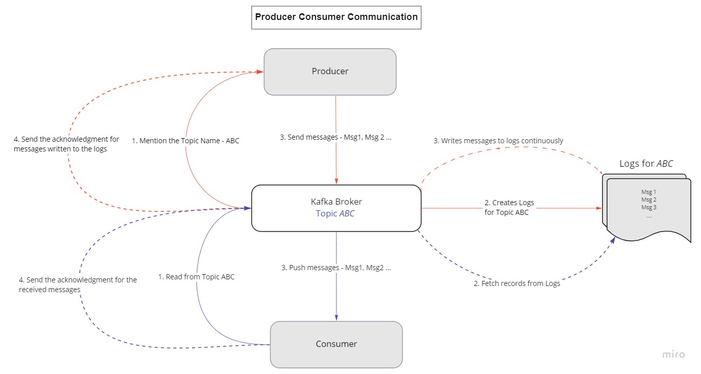
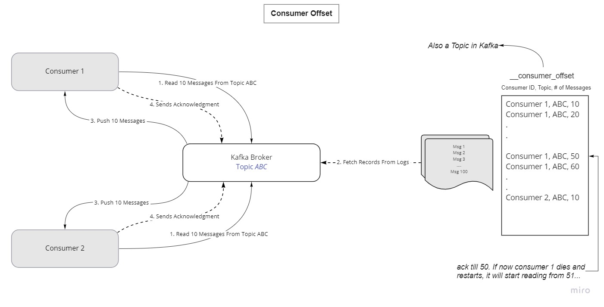
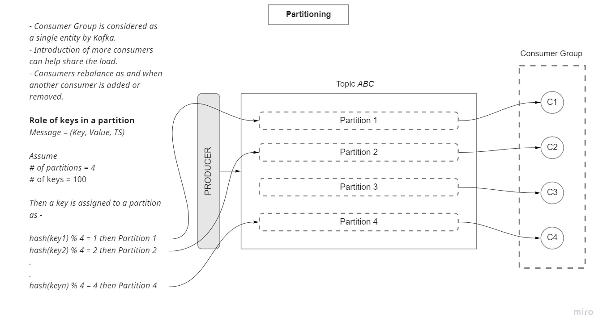
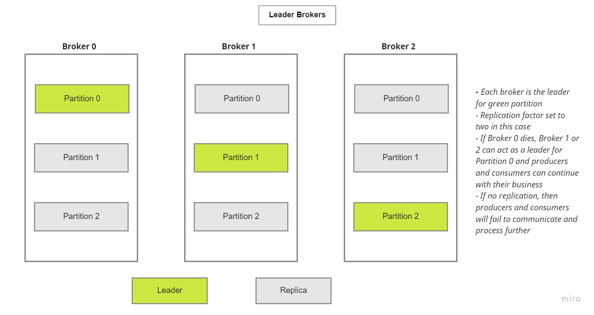
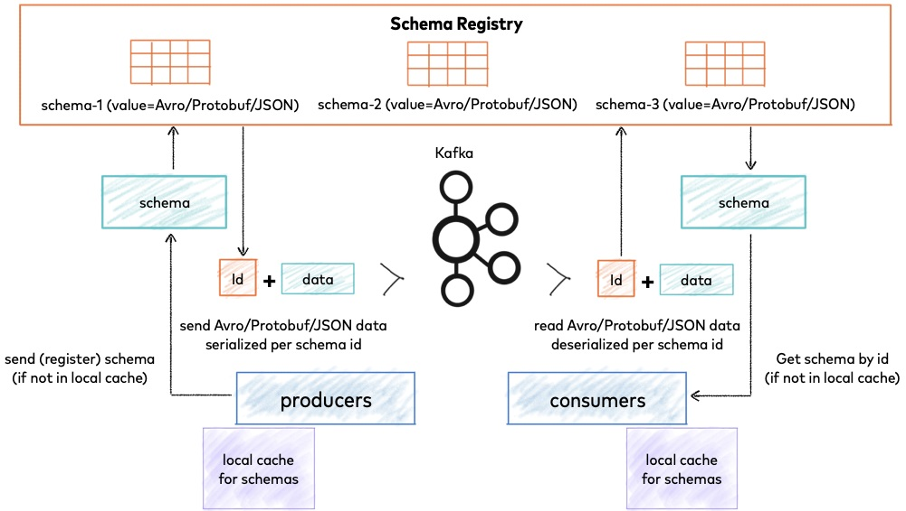
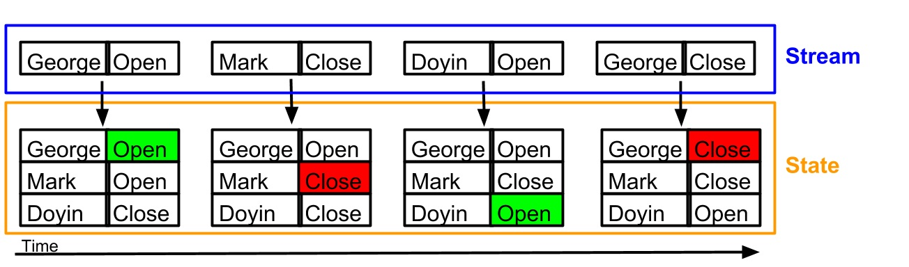

# Kafka

An excellent gamification of the Kafka concepts in [Gently Down The Stream](https://www.gentlydownthe.stream/#/3)

### Messages in Kafka

- Kafka messages generally consist of three things -
    - Key
    - Value
    - Timestamp

### Topics in Kafka

A topic is an abstraction of a concept.
- Producer pushes message to a topic
- Consumer consumes message from a topic

### Kafka Broker

Kafka Broker - A physical machine on which Kafka is running.
Kafka Cluster - A cluster of Kafka brokers.

### Logs
- Represents data segments present in the disk
- Stores messages in an ordered fashion
    - Assigns sequence id to each message before storing in logs 


## Workflow

Shows the communication between a producer, kafka broker and a consumer  



Usage of consumer offset to help restart the consumption from where it stopped  



Consumer group and partitioning  



Leader Broker and Replication Factor



## Configuring Kafka

### Topic Configurations

`retention.ms` - Amount of time the logs will stay before they get deleted.  
`cleanup.policy` [delete|compact] - `delete` will delete the messages after the retention threshold, `compact` will remove all but the latest keys.  
`partition` - scalability count  
`replication` - number of times the partition would be replicated across brokers

### Consumer Configurations  

`offset` - What has already been read by the consumer  
`consumer.group.id` [earliest|latest]- Identifier for the consumer group  
`auto.offset.reset` - when the consumer connects for the firt time to a topic, offset does not exist for this `consumer.group.id`. It is unaware of where to start reading from. `earliest` will cause it to read from the very beginning of the logs, `latest` will cause it to read from the current time onwards

### Producer Configurations

`acks` [0|1|all]
- `0` - *"Fire And Forget"*, the producer will not wait for an acknowledgement. Very fast as the producer does not have to wait for the acknowledgements
- `1` - Waits for the leader broker to write the message to the disk. A message could be missed in this case if the leader writes the message and then dies before it is replicated
- `all` - Waits for the leader and all the replicas to write the message to the disk. Would be slow as all the messages will have to be transferred to the replica, write to the disk and then wait for all the acks.

## Kafka Dockerfile

### Zookeeper Service

**Note:** We do not need zookeeper anymore in kafka but it was added to avoid creating a fresh dockerfile

It is used to maintain the metadata knowledge for kafka like topic name, retention time, partitons etc.


## Scripts

### Producer script

```python
producer = KafkaProducer(bootstrap_servers=["localhost:9092"], 
                        value_serializer=lambda x : dumps(x).encode('utf-8'))
```

Here, `KafkaProducer` is a Kafka client that publishes records to the Kafka cluster. `bootstrap_servers` is a list of servers that the producer should connect to bootstrap initial cluster metadata. This does not have to be the full node list. It just needs to have at least one broker that will respond to a Metadata API Request. The metadata consists of the topics, their partitions, the leader brokers for those partitions etc.

`value_serializer` is used to change the encoding from bytes to utf-8.

### Consumer Script

```python
consumer = KafkaConsumer(
    'demo_1',
    bootstrap_servers=["localhost:9092"],
    auto_offset_reset='earliest',
    enable_auto_commit=True,
    group_id='consumer.group.id.demo.1',
    value_deserializer=lambda x: loads(x.decode('utf-8'))
)
```

When you set `enable.auto.commit` to `True` the consumer will commit the offsets corresponding to the messages it has read. If the consumer crashes or is shut down, its partitions will be re-assigned to another member, which will begin consumption from the last committed offset of each partition. If the consumer crashes before any offset has been committed, then the consumer which takes over its partiton will use the `auto.offset.reset` policy.

## Avro and Schema Registry

### Avro

- Avro is a data serialization system
- Schema stored separate from the record. Hence, schema is need to read a record
- Records are stored using binary encoding or JSON
- Avro advantages:
    - Smaller file size (vs JSON)
    - Schema evolution. You can evolve the schema overtime without breaking the consumers
    - Avro clients provide automatic validation against schema

**Why Schema Compatibility?**

Suppose a producer produces JSON objects that look like below and you setup your consumer to consume the message in the same format.
```python
{
    id : String,
    name : String,
    age: Int
}
```

If the producer now suddenly changes it's `age` column datatype to a `String`, then your consumer will start to fail. This is where schema registry comes into place.

### Schema registry

[Confluent Docs](https://docs.confluent.io/platform/current/schema-registry/index.html#id1) on Schema Registry.

Stores a versioned history of all schemas based on specified subject name strategy, provides multiple compatibility settings and allows evolution of schemas according to the configured compatibility settings and expanded support for these schema types. 

Schema Registry lives outside of and separately from your Kafka brokers. It is a distributed storage layer for schemas which uses Kafka as its underlying storage mechanism.


Image Source: [confluent.io](https://www.confluent.io)

**What if the Schema cannot be compatible?**

In the cases where you are forced the break the schema compatibility, it is better to create two separate topics. One with the older schema and another with a new schema. And you can then use and intermediate KStreams job for down-conversion

</img>
Image Source: [confluent.io](https://www.confluent.io)

### Avro Example Scripts

**Producer.py**

```python
producer = AvroProducer(producer_config, default_key_schema=key_schema, default_value_schema=value_schema)
```
`AvroProducer` is a Kafka producer client which does avro schema endocing to messages, handles schema registration, message serialization.


```python
producer.produce(topic='datatalkclub.yellow_taxi_rides', key=key, value=value)
```
`produce` will produce messages asynchronously to to the topic. Adding `producer.flush()` after produce makes the operation synchronous as `flush()` will block until the previously sent messages have been delivered.

**Consumer Script**

```python
    consumer_config={
        "bootstrap.servers" : "localhost:9092",
        "schema.registry.url" : "http://localhost:8081",
        "group.id" : "taxirides.avro.consumer.1",
        "auto.offset.reset" : "earliest"
    }

    consumer = AvroConsumer(
        consumer_config
    )
```
Kafka Consumer client which does avro schema decoding of messages. Handles message deserialization.

```python
message = consumer.poll(5)
```
This is an overriden method from `confluent_kafka.Consumer` class. This handles message deserialization using avro schema

## Kafka Stream

- Client library for building stream application
- Data should be from Kafka to Kafka
- Stream application
    - Fault tolerant
    - Scalable
- Event processiing with milliseconds latency
- Provides a convenient DSL (Domain Specific Language)

### Kafka Stream vs State

[Kafka Streams - Not Looking at Facebook](https://timothyrenner.github.io/engineering/2016/08/11/kafka-streams-not-looking-at-facebook.html)



If we consider the above image as a timeline from left to right, the state of users keeps on changing as and when an event is recorded for that user. The events aren't standalone, they are connected to a *state*

### Faust

[Faust](https://faust.readthedocs.io/en/latest/index.html) is a stream processing library, porting the ideas from Kafka Streams to Python.

**stream_taxi_json.py**

In the below line, we initiliaze an instance of the library the provides the core API of Faust.

```python
app = faust.App(
    'faust.stream', # A name for the application (the id)
    broker='kafka://localhost:9092' # message broker
    )
```

Use the topic() method to create a topic description, used to tell stream processors what Kafka topic to read from, and how the keys and values in that topic are serialized:
```python
topic = app.topic('yellow_taxi_ride.json', value_type=TaxiRide)
```

The `agent()` decorator is used to define an asynchronous stream processor: 

```python
@app.agent(topic)
async def start_reading(records):
    async for record in records:
        print(record)
```

Running the below command lists the agents and the topics used by them. Here `start_reading` is our agent.
```bash
(base) ankur@de-zoomcamp:~/datatalks_zoomcamp/6_kafka/streams$ python stream_taxi_json.py agents
┌Agents──────────┬───────────────────────┬───────┐
│ name           │ topic                 │ help  │
├────────────────┼───────────────────────┼───────┤
│ @start_reading │ yellow_taxi_ride.json │ <N/A> │
└────────────────┴───────────────────────┴───────┘
```

**stream_count_vendor_trips.py**

A table is a distributed in-memory dictionary, backed by a kafka changelong topic used for persistence and fault-tolerance.

```python
vendor_rides = app.Table("vendor_rides", default=int)
```

Here we set default value so the table acts a `defaultdict`. The default argument is passed in as a callable, and in our example calling int() returns the number zero, so whenever a key is missing in the table, it’s initialized with a value of zero

### Time in Kakfa

Every event has an associated notion of time -
- Event time (extending TimestampExtractor)
- Processing time
- Ingestion time

One can use any of the above three value for their use case.